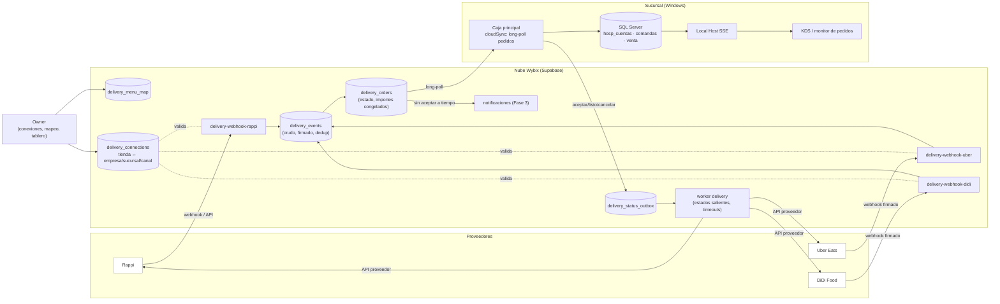

# Rappi, Uber Eats y DiDi Food dentro de Wybix: auditoría del sistema y flujos

Fecha: 7 de octubre de 2026. Auditoría de solo lectura (Claude), hecha en paralelo al trabajo de Codex y sin tocar sus archivos ni procesos.

**Complementa, no repite:**

- `AUDITORIA-EXPANSION-20261007.md` §8 y `AUDITORIA-IMPRESION-PLATAFORMAS-20261007.md` (Codex). Ahí están la investigación de las APIs públicas de cada proveedor (acceso, firmas, estados, dinero), la comparación directo/agregador y la lista de pruebas.
- **Este documento** responde otra pregunta: *con el código que existe hoy, dónde vive cada paso del flujo, qué se reutiliza tal cual, qué falta y qué se rompería si se hiciera de la forma obvia.*

Nada de esto está implementado ni contratado. No se contactó a ningún proveedor.

---

## 1. Lo que ya existe y se reutiliza

| Pieza | Dónde | Cómo sirve a un pedido de plataforma |
|---|---|---|
| **Canales y precios por canal** | `commercial_policy` (JSON), `0053_comercial`, `shared/comercial.ts` | Cada conexión (tienda de Rappi, Uber o DiDi) se liga a un **canal** existente. Sus precios alimentan el menú que se publica. No reescriben pedidos ya pagados. |
| **Snapshot comercial de la venta** | `sales.commercial_snapshot`, `hosp_cuentas.commercial_context` | Ahí se congelan el canal, el folio externo y los importes del pedido. Owner ya reporta ventas por canal (`20261012130000`). |
| **Pago mixto y «Pagado en plataforma»** | `sale_payments` (`0054`) | Un pedido prepagado se cobra como `PLATAFORMA`. Si el comercio cobra efectivo contra entrega, ese tramo va como `EFECTIVO`, y solo ese entra al cajón. |
| **Cuenta sin mesa, número del día y seguimiento** | `hosp_cuentas` (`mesa_id NULL`, `numero_dia`, `seguimiento`, `customer_id`) | Un pedido de plataforma **es** una cuenta para llevar: etiqueta «Uber #A3F9», número del día, QR de seguimiento y cliente. |
| **Comandas a cocina por estación** | `hosp_ordenes`, `hosp_orden_lineas` (`station_id`, `comanda_id`), KDS en Local Host | El pedido entra a cocina **igual que una comanda de mesero**. No se necesita un KDS nuevo. |
| **Idempotencia de líneas** | `hosp_orden_lineas.origen UNIQUEIDENTIFIER` | Un UUID determinista por línea externa evita una comanda doble si llega dos veces el mismo callback. |
| **Tiempo real dentro de la sucursal** | Local Host + SSE (`kds-web/app.js` → `/api/s/eventos`) | Cocina, pantallas y monitor de pedidos se enteran al instante, sin cambios. |
| **Identidad de equipo y multiempresa** | Fase 1: `devices`, credencial de equipo, `wx_actor_admin`, RLS por membresía | La caja principal se autentica como equipo. El dueño administra conexiones con **MFA AAL2** (Fase 3). |
| **Bandeja nube → caja** | `pos-sync` + `transfer_inbox` (Fase 2) | Ya existe el patrón «la nube guarda, la caja recoge y confirma». Sirve para pedidos, con un cambio de velocidad (§2, B1). |
| **Motor de notificaciones** | Fase 3: `notification_outbox` → entregas → push y correo | Avisos del tipo «pedido sin aceptar», «tienda sin caja conectada» o «cancelación solicitada». |
| **Auditoría y aprobaciones** | `cloud_audit`, aprobaciones a distancia (Fase 3) | Rastro de quién aceptó, rechazó o canceló, y autorización para un reembolso parcial. |
| **Trabajos de impresión durables** | Fase 3 (Mobile) y auditoría de impresión (Windows) | Comanda y ticket de plataforma con reintento, sin duplicar la venta. |

---

## 2. Brechas reales (código actual)

| # | Brecha | Evidencia | Consecuencia si se ignora |
|---|---|---|---|
| **B1** | La caja de Windows consulta la nube **cada 5 minutos** (`cloudSync.js`, `intervalMs` 300 000). | Scheduler en `startScheduler()` | Los proveedores exigen respuesta en minutos (aceptar o rechazar, tiempos de preparación). Con 5 min, los pedidos vencen o se cancelan solos. |
| **B2** | La venta **recalcula en SQL** el precio de los modificadores y rechaza diferencias de más de 1 centavo si no hay cotización (`sp_register_sale`, ~líneas 461–520). | Bloque «PRECIO DE LOS MODIFICADORES» | El precio que cobró la plataforma (con su promoción y redondeo) **no pasa** la validación. La tentación de «apagar la validación» abre el hueco de fraude que esa regla cierra. |
| **B3** | La cotización comercial solo nace del motor local y de un actor/caja (`commercial_quotes`). No existe una cotización de **origen externo**. | `actor_id`, `register_id`, `expires_at` | No hay forma legítima de registrar «lo que el cliente ya pagó en la plataforma» sin volver a aplicar las promociones locales. |
| **B4** | El canal es un `id` libre dentro de JSON. No hay una entidad «conexión» que ligue tienda externa ↔ empresa ↔ sucursal ↔ canal. | `commercial_policy.payload.channels` | Un callback no tiene contra qué validarse. Riesgo de aceptar pedidos de la tienda de otra empresa. |
| **B5** | No hay mapeo de catálogo externo: productos, variantes, grupos y modificadores de cada plataforma ↔ `products` / `modifier_options`. | — | Sin mapeo no hay pedido operable. La salida fácil, «crear productos genéricos», destruye inventario y recetas. |
| **B6** | No hay endpoints públicos de webhook ni almacenamiento de credenciales por proveedor y tienda. | Funciones actuales: `pos-sync`, `fiscal-*`, `notificaciones`… | — |
| **B7** | No hay máquina de estados de un pedido externo ni cola de estados de salida hacia el proveedor. | — | Sin esto no se puede aceptar, marcar listo, cancelar ni reembolsar. |
| **B8** | El corte no separa la **venta de plataforma pagada fuera** de la **liquidación** (comisión y depósito). | Reporte por canal = neto **antes** de comisiones (README comercial) | La utilidad por canal se ve inflada; la conciliación de depósitos queda manual. |
| **B9** | POS Mobile en ferias no tiene Local Host ni KDS, y su sincronización es por tablet. | Fase 2 | No conviene recibir pedidos de plataforma en un EVENT en la primera versión. |

---

## 3. Arquitectura en Wybix (dónde vive cada cosa)



**Decisiones de arquitectura:**

1. **La nube recibe y la caja decide.** La caja de Windows **nunca** abre puertos a Internet. El webhook de cada proveedor vive en una Edge Function, que valida la firma (Uber HMAC-SHA256, DiDi MD5 de cuerpo + secreto, Rappi según contrato), guarda el evento **crudo** y responde el ACK de transporte en menos de 6 s (DiDi lo exige). Procesar viene después.
2. **ACK de transporte ≠ aceptación comercial.** «Recibido» se responde siempre que el evento quedó guardado. «Aceptado» lo emite la **caja** (manual, o automático si el negocio lo configura), porque solo la sucursal sabe si hay capacidad, insumos y turno abierto.
3. **Entrega a la caja casi en tiempo real (resuelve B1):**
   - Una nueva acción `delivery_inbox` en `pos-sync` con **long-poll**: la caja pregunta y la función espera hasta ~25 s a que haya algo.
   - Usa la credencial de equipo que ya existe, funciona detrás de NAT y no requiere puertos.
   - Solo corre si la sucursal tiene conexiones activas.
   - El ciclo de 5 min **sigue igual** para lo demás.
   - Se descarta Supabase Realtime en la caja: la caja no tiene JWT de usuario, y un JWT para equipos agrega superficie de ataque sin necesidad.
4. **Idempotencia en dos niveles:**
   - **Nube:** `unique (proveedor, tienda_externa, pedido_externo)` y deduplicación de eventos por id de evento del proveedor.
   - **Caja:** una tabla local `delivery_pedidos` (externo → `hosp_cuentas.id`) con clave única, más `origen` determinista por línea.
   - Un callback repetido **no** imprime dos comandas.
5. **Precios: cotización de origen externo (resuelve B2/B3).** El proceso principal crea en `commercial_quotes` una cotización con `source = 'PLATFORM'`, el pedido externo y sus importes congelados. Así `sp_register_sale` la consume **sin desactivar** la validación de modificadores, porque la cotización **es** la fuente del precio. Las promociones locales **no** se vuelven a aplicar.
6. **Las conexiones son entidades (resuelve B4):**
   - `delivery_connections`: proveedor, tienda externa, empresa, sucursal, canal, estado y credenciales en Vault.
   - El callback nunca trae `company_id`: se deduce de la tienda conectada.
   - Administrarlas exige **OWNER/ADMIN con AAL2** (`wx_actor_admin`).
7. **Mapeo, no clonación (resuelve B5).** `delivery_menu_map` liga id externo de producto/variante/modificador ↔ UUID de Wybix. Lo que no tiene mapeo **no** se acepta solo: va a revisión con aviso al dueño.
8. **Fuera de alcance en la v1:** POS Mobile y eventos (B9). El canal de feria se vende en la tablet como hasta hoy.

---

## 4. Flujos

### 4.1 Conectar una tienda (una vez, en Owner)

1. El dueño elige el proveedor en Owner y autoriza (OAuth en Uber; token o credenciales de partner en DiDi y Rappi). **Requiere AAL2.**
2. Wybix lista las tiendas del proveedor y el dueño elige cuál corresponde a qué sucursal y a qué **canal** (p. ej., el canal «Uber Eats» que ya existe en Precios por canal).
3. **Mapeo de menú:** Wybix muestra el menú del proveedor junto al catálogo de la sucursal, sugiere coincidencias (nombre/SKU) y el dueño confirma. Lo no mapeado queda señalado.
4. **Publicar menú (opcional, por proveedor):** precios del canal + disponibilidad → API del proveedor. El origen es la lista de precios del canal; no se crean productos nuevos.
5. **Prueba en sandbox** (si el proveedor lo ofrece) y activación.
6. **Antes de activar:** verificar si la tienda ya tiene otro integrador (Soft Restaurant u otro). En DiDi, una tienda solo puede ligarse a **una** app de producción.

### 4.2 Pedido normal (prepago)

```mermaid
sequenceDiagram
  participant P as Proveedor
  participant N as Nube Wybix
  participant C as Caja principal
  participant K as Cocina (KDS)
  P->>N: webhook nuevo pedido (firmado)
  N->>N: guardar evento crudo + dedup
  N-->>P: ACK transporte (< 6 s)
  N->>P: consultar detalle completo (si el contrato lo pide)
  N->>N: delivery_orders = RECIBIDO; validar mapeo
  C->>N: long-poll delivery_inbox
  N-->>C: pedido con importes congelados
  C->>C: abrir hosp_cuenta sin mesa, canal, número del día
  Note over C: Aceptar (manual o automático con turno abierto)
  C->>N: estado ACEPTADO + minutos de preparación
  N->>P: aceptar (outbox, reintentos)
  C->>K: comanda por estación (origen determinista)
  K->>C: listo
  C->>N: LISTO
  N->>P: listo para recoger
  Note over C: Repartidor recoge → registrar venta
  C->>C: sp_register_sale con cotización PLATFORM y pago PLATAFORMA
  C->>N: ENTREGADO + hecho de venta (outbox Fase 1)
```

- **La venta (inventario + pago) se registra al entregar al repartidor**, no al aceptar. Así un pedido cancelado antes de prepararse no toca el inventario. Si se canceló ya preparado, se registra una **merma** con motivo «pedido cancelado» (flujo de merma existente), sin crear una venta.
- **El corte:** el pago `PLATAFORMA` aparece en su renglón y **no** suma al efectivo esperado.

### 4.3 Efectivo cobrado por el comercio

Cuando el contrato lo permite (Uber `cash_amount_due`, DiDi `shop_paid_money`):

- la venta lleva **dos pagos**: `PLATAFORMA` por lo prepagado y `EFECTIVO` por lo que entrega el repartidor o el cliente;
- solo el efectivo entra al cajón (`0054` ya lo modela);
- **nunca** se asume que «todo pedido DiDi es prepago».

### 4.4 Cancelaciones, reembolsos y cambios

| Caso | Qué hace Wybix |
|---|---|
| El proveedor cancela antes de aceptar | Cuenta descartada; nada en inventario ni en cocina. |
| Cancela después de aceptar y antes de preparar | Comandas canceladas en el KDS (flujo existente) y cuenta cerrada sin venta. |
| Cancela ya preparado | Merma con motivo y aviso al dueño. La venta no existe; el dinero, si lo hubo, se ve en la conciliación. |
| Solicitud de cancelación o reembolso (DiDi y Uber la tienen) | Pasa a **pendiente de decisión** en la caja. Si el negocio lo configura, se pide **autorización a distancia** a la dueña (Fase 3). Después se responde al proveedor. |
| Cancelación parcial o artículo faltante | Se ajustan las líneas antes de entregar. Si la venta ya existía, se hace una **devolución parcial** con su importe exacto (el motor ya reparte centavos). |
| Pedido con producto sin mapear o agotado | Revisión: la caja ve «falta mapear X». Se rechaza o se marca el artículo no disponible, según el proveedor. **Nunca** se crea un producto genérico. |

### 4.5 La caja sin Internet o apagada

- La nube conserva el pedido y lleva el **plazo del proveedor**.
- Si a cierto porcentaje del plazo no hay caja conectada:
  - aviso push al dueño («Pedido de Uber sin aceptar: la caja no está conectada»);
  - la tienda se marca **pausada** en el proveedor, si su API lo permite, para dejar de recibir pedidos que no se pueden atender.
- Cuando la caja vuelve, recoge lo pendiente. Lo que ya venció aparece como vencido, **sin** comanda.
- La operación local (mostrador, mesas) sigue igual sin Internet. Solo los pedidos de plataforma dependen de la red, como en cualquier POS.

### 4.6 Conciliación (después; resuelve B8)

- Importar el reporte o API de liquidación del proveedor: pedido externo, bruto, descuentos y **quién los financió**, comisión, impuestos y neto depositado.
- Cruzarlo contra `delivery_orders` y `sales` por folio externo.
- En Owner, ver por canal: venta bruta → comisiones → depósito esperado → depósito real.
- La comisión **viene del proveedor o del contrato**; no es un porcentaje fijo de Wybix.

---

## 5. Diferencias por proveedor que afectan el diseño

| | Uber Eats | DiDi Food | Rappi |
|---|---|---|---|
| Acceso | Programa de partner con OAuth y aprobación | Partner, NDA, app de prueba y piloto | Contrato técnico de restaurantes para México **pendiente**; API directa o agregador |
| Firma del webhook | HMAC-SHA256 del cuerpo crudo | `didi-header-sign` = MD5(cuerpo + secreto) | Pendiente de documentación de partner |
| Detalle | Webhook ligero → consultar el pedido | Webhook con datos y consulta disponible | Pendiente |
| Particularidades | `promo_funding_splits`, `cash_amount_due` | IDs de 64 bits (**no** usar `Number`), ACK en 6 s, una app de producción por tienda | — |
| Primer candidato | **Sí**: documentación pública más completa | Segundo | Tercero (o vía agregador) |

Una sola bandeja con un **adaptador por proveedor**. La diferencia entre proveedores vive en `delivery-webhook-<proveedor>` y en su cliente de API, nunca en la caja.

---

## 6. Tablas propuestas

**Nube** (con migración, RLS por membresía y solo service_role en lo sensible):

- `delivery_connections`: proveedor, tienda externa, empresa, sucursal, canal, estado y `credencial_ref` (Vault).
- `delivery_menu_map`: id externo ↔ UUID de producto/opción, por conexión.
- `delivery_events`: crudo, firma verificada, `unique(proveedor, event_id)` y retención limitada (datos personales).
- `delivery_orders`: identidad externa única, estado, plazos, importes congelados, responsable de descuentos y efectivo por cobrar.
- `delivery_status_outbox`: estados salientes con reintentos, como `notification_deliveries`.
- `delivery_settlements`: liquidaciones importadas (fase posterior).

**Sucursal** (SQL Server, con migración, baseline y plantilla):

- `delivery_pedidos`: clave externa única → `hosp_cuentas.id`, estado local y plazo.
- `commercial_quotes.source`: `'LOCAL' | 'PLATFORM'`, más una referencia al pedido externo.

---

## 7. Orden recomendado

| Fase | Contenido | Depende de |
|---|---|---|
| 0 | **Decisión comercial:** directo con Uber o agregador (p. ej. Deliverect), con cotización y cobertura reales en México | El dueño |
| 1 | Modelo y bandeja: conexiones, eventos, pedidos, `delivery_inbox` long-poll, `delivery_pedidos` local, cotización `PLATFORM`; **fixtures** en lugar de proveedor real | Ninguna (se puede hacer ya) |
| 2 | Caja: monitor de pedidos, aceptar/rechazar, cuenta sin mesa → KDS → listo → venta al entregar, corte | Fase 1 y **diseño de Astra** para el monitor |
| 3 | Primer adaptador (Uber Eats sandbox): firma, detalle, estados salientes, plazos y avisos | Acceso de partner de Uber |
| 4 | Owner: conexiones con AAL2, mapeo de menú, tablero en vivo y avisos | Fase 3 y diseño de Astra |
| 5 | DiDi y luego Rappi (o el agregador) | Acceso de partner de cada uno |
| 6 | Conciliación de liquidaciones | Formato de reportes de cada proveedor |

Cada fase incluye su migración SQL Server (fuente canónica, baseline y plantilla) y de nube en el mismo bloque. Nada se despliega sin autorización.

---

## 8. Lo que no hay que hacer

- Abrir un puerto en la caja de Windows para recibir webhooks.
- Recibir pedidos en el ciclo de 5 min.
- Desactivar la validación de precios de `sp_register_sale` para que «pasen» los precios de la plataforma.
- Crear productos «Rappi – Dona» duplicados: un producto conserva su UUID, receta e inventario en todos los canales.
- Volver a aplicar promociones locales a un pedido que el cliente ya pagó.
- Sumar al cajón el dinero que cobró la plataforma.
- Confiar en `company_id`, `store_id` u otros datos del cuerpo sin validar la firma **y** la conexión.
- Usar `Number`/`JSON.parse` sin cuidado con los IDs de DiDi.
- Prometer integración porque existe el canal: **un canal no es una conexión**.
